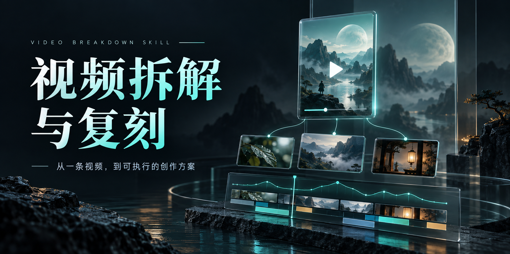
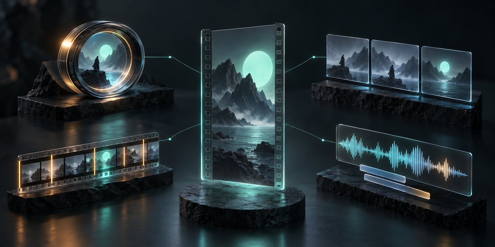
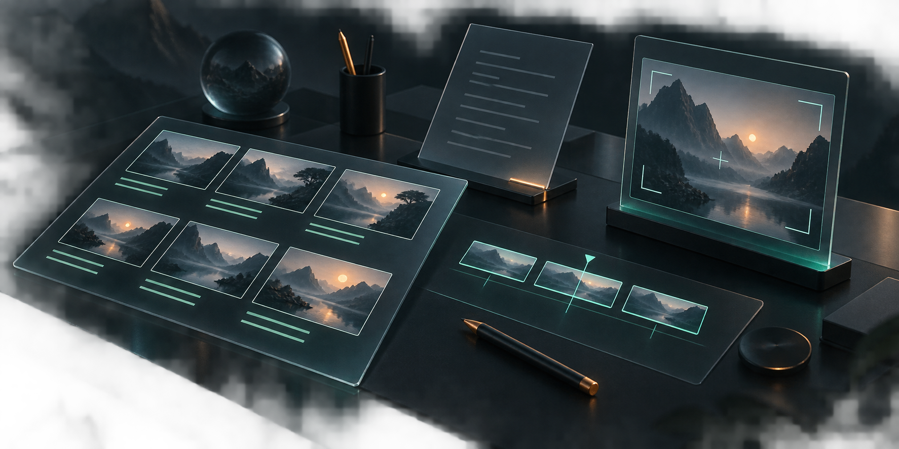

# README 配图生成记录

生成方式：Codex 内置 `image_gen`（未使用 CLI 或外部 API 脚本）。

用途：为 README 制作 1 张封面与 2 张概念插画。图片沿用解析报告的深色与青绿色视觉风格；`doubaoSkill.jpg` 为原有报告截图，保持原文件不变。

## cover.png



### 完整提示词

```text
Use case: stylized-concept. Professional open-source GitHub README artwork for a Chinese video analysis and storyboard skill named video-breakdown-skill. Premium editorial 3D illustration, graphite navy background (#0b141b), translucent smoked glass planes, precise mint teal (#31d9bd) edge light, small icy blue accents, warm amber details used very sparingly. Cinematic studio rendering, soft physically plausible shadows, fine film grain, clean generous negative space, restrained sharp composition. No logos, no company branding, no claims of results, no random microtext, no watermarks. Wide landscape aspect ratio about 2:1. This is an original conceptual illustration, not a screenshot of software. Primary request: Create the striking main README cover banner. Left half is beautiful confident large Chinese typography in two lines reading exactly '视频拆解' then '与复刻'. Above it put the small clean uppercase text exactly 'VIDEO BREAKDOWN SKILL'. Below it put one restrained subtitle exactly '从一条视频，到可执行的创作方案'. On the right half, a floating vertical short-video glass panel with a stylized cinematic mint-lit landscape thumbnail and white play triangle. Three smaller cinematic thumbnail cards fan out beneath it, connected visually to an elegant editing timeline and a thin rhythm curve. Strong hierarchy, thoughtful grid and intentional empty space. Render Chinese text legibly, perfectly, with generous spacing. All elements safely inset at least 7% from canvas boundaries. Avoid clutter and extra text.
```

## analysis-dimensions.png



### 完整提示词

```text
Use case: stylized-concept. Professional open-source GitHub README artwork for a Chinese video analysis and storyboard skill named video-breakdown-skill. Premium editorial 3D illustration, graphite navy background (#0b141b), translucent smoked glass planes, precise mint teal (#31d9bd) edge light, small icy blue accents, warm amber details used very sparingly. Cinematic studio rendering, soft physically plausible shadows, fine film grain, clean generous negative space, restrained sharp composition. No logos, no company branding, no claims of results, no random microtext, no watermarks. Wide landscape aspect ratio about 2:1. This is an original conceptual illustration, not a screenshot of software. Primary request: Create a concept illustration explaining how a short video is deconstructed into four creative dimensions. A central floating vertical film panel shows a serene 3D geometric landscape of dark mountain forms under a mint moon. Around it are four carefully art-directed physically rendered objects: an illuminated circular aperture highlighting the opening moment; a sequence of three translucent storyboard frames for narrative; a horizontal amber and mint editing strip with rhythmic cuts; and a glass audio waveform with two neat abstract subtitle bars. Elegant exploded-view composition, isometric cinematic perspective, visually balanced, tactile objects rather than flat icons. No text or letters anywhere. Restrained lighting, no cyberpunk circuitry, no particles. This will accompany the four analysis dimensions table in a README.
```

## creation-workbench.png



### 完整提示词

```text
Use case: stylized-concept. Professional open-source GitHub README artwork for a Chinese video analysis and storyboard skill named video-breakdown-skill. Premium editorial 3D illustration, graphite navy background (#0b141b), translucent smoked glass planes, precise mint teal (#31d9bd) edge light, small icy blue accents, warm amber details used very sparingly. Cinematic studio rendering, soft physically plausible shadows, fine film grain, clean generous negative space, restrained sharp composition. No logos, no company branding, no claims of results, no random microtext, no watermarks. Wide landscape aspect ratio about 2:1. This is an original conceptual illustration, not a screenshot of software. Primary request: Create a concept illustration about converting video insights into an actionable shooting and AI prompting plan. A beautiful floating dark-glass director's desk in isometric perspective. Foreground left: a carefully laid out storyboard sheet with six landscape thumbnails using coherent geometric mountain scenery, abstract tidy mint lines beneath each frame. Center: a thin translucent script sheet with clean horizontal light strokes, no letters. Right: a single upright generated-shot preview card shows the same scenery with a camera framing guide. A restrained strip of three mint rectangular timeline clips ties the desk elements together. Elegant high-end 3D still life with enough negative space, calm purposeful creative-workspace feel, a small amber pencil provides accent. No text or letters anywhere. This will illustrate storyboard and prompt deliverables in the README, not a real product interface.
```
